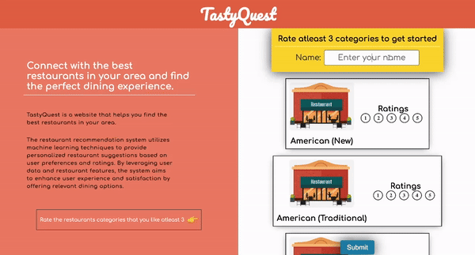

# Restaurant-Recommendation-system-using-ML

## Restaurant Recommendation System

### Overview
This repository contains the code for a restaurant recommendation system developed using neural network and cosine similarity models. The recommendation system aims to provide personalized suggestions to users based on their preferences and past interactions with restaurants. The system utilizes machine learning techniques to analyze user behavior and restaurant characteristics to generate accurate recommendations.

### Files
1. **Data Preprocessing.ipynb**: This notebook contains the code for preprocessing the raw restaurant data. It includes tasks such as data cleaning, handling missing values, and transforming data into a suitable format for model training.
   
2. **Feature Engineering.ipynb**: This notebook focuses on feature engineering, where relevant features are selected and engineered to improve the performance of the recommendation system. Feature engineering techniques such as one-hot encoding, scaling, and dimensionality reduction may be applied here.

3. **Model.ipynb**: This notebook implements the neural network model and cosine similarity model for restaurant recommendation. The neural network model is trained on the preprocessed data to learn user preferences and restaurant characteristics, while the cosine similarity model computes similarity scores between restaurants based on their features.

### Integration
In addition to the model development, we have also created an API to integrate the recommendation system into our own website. The API allows users to receive personalized restaurant recommendations based on their preferences and interactions. The web app interacts with the API to fetch recommendations and display them to the users in a user-friendly interface.

For detailed instructions on running the code and deploying the recommendation system, please refer to the documentation provided within each notebook and the API documentation. Feel free to explore and modify the code to adapt the recommendation system to specific requirements or datasets. We hope this repository serves as a useful resource for building and deploying restaurant recommendation systems.

### Contributors
- [Vishwa Pujara](https://github.com/Vishwapujara)
- [Khush Patel](https://github.com/khushpatel2121)
- [Sujay Shah](https://github.com/sujayshah3011)

- # WebApp Preview 

- Link to the [WebApp](https://65fbb93c7cd11a77ecc5b4d5--wonderful-meerkat-d8e461.netlify.app/) (it might take a minute to start the server)

